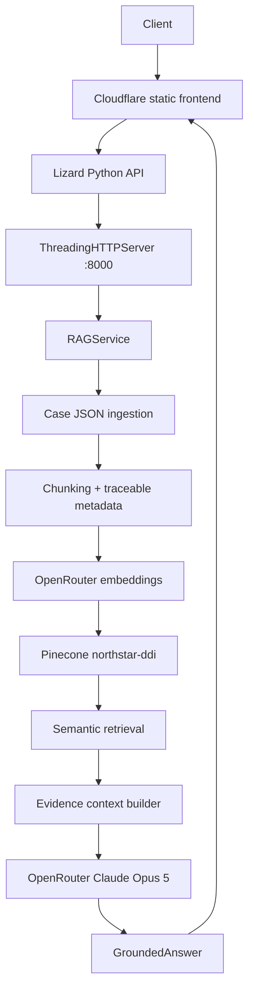

# Architecture

Due Diligence Intelligence separates deterministic diligence methodology from the RAG runtime. The deployed path is:

## Runtime layers

**Frontend.** Cloudflare Worker `ddi` serves the browser shell. The browser may set `window.DD_API_BASE` to the Python API origin. It never receives provider credentials.

**API layer.** Lizard service `due-diligence-intelligence` in `us-east-1` runs Python's standard-library `ThreadingHTTPServer`, listening on `0.0.0.0:8000`. Startup is `python3 -m app.api.server`.

**Ingestion and indexing.** `app/ingestion/pipeline.py` converts the synthetic Northstar source register into 900-character chunks with 120-character overlap. Each chunk retains document, source, page, section, date, evidence tier, and topic metadata.

**Embeddings.** When `OPENROUTER_API_KEY` is configured, `configured_provider()` selects `OpenRouterEmbeddingProvider`, which calls the OpenRouter-compatible `/embeddings` endpoint. The deployed model is `openai/text-embedding-3-small`; every returned vector must have dimension 1536. Vectors are never padded, truncated, or reshaped. A direct OpenAI-compatible provider remains available for backward compatibility through `LLM_API_KEY`, `EMBEDDING_MODEL`, and `EMBEDDING_DIMENSION`. Without provider credentials, tests use a deterministic hash provider explicitly labeled offline.

**Vector database.** Live mode requires `PINECONE_API_KEY` plus `PINECONE_INDEX` or `PINECONE_HOST`. The current deployment uses Pinecone index `northstar-ddi`, namespace `northstar-validation`, dimension 1536, and cosine similarity. Startup upserted five synthetic chunks, and live retrieval returned traceable matches.

**Reasoning.** Retrieved evidence is assembled as labeled `[E#]` context and sent to OpenRouter using `OPENROUTER_BASE_URL`, `OPENROUTER_MODEL`, and `OPENROUTER_API_KEY`. The deployed reasoning route is `anthropic/claude-opus-5`. The prompt requires JSON and evidence-bounded inference. The final validation reached OpenRouter but generation was blocked by an HTTP 402 caused by the available token/credit budget; no final Claude answer is claimed.

## Evidence boundary

Similarity ranks candidate evidence; it does not establish evidentiary strength. For the validated Northstar revenue query, `website-2025` ranked highest by similarity while `audited-financials-2024` was the stronger direct source. Metadata and evidence tiers remain attached so a reviewer can evaluate source quality, period, directness, and corroboration.

## Security boundary

All Pinecone and OpenRouter calls occur server-side. Secrets are configured through Lizard's secret management and are excluded from Git, Dockerfiles, frontend JavaScript, and documentation. The public repository contains synthetic Northstar data only.

## Validation boundary

Live OpenRouter embeddings and Pinecone retrieval have been validated in the deployed application. The reasoning integration is wired into the query path and reached the provider during final validation, but generation was not captured because the provider returned HTTP 402.

The original deterministic workflow remains available through `scripts/evidence_tracker.py` and related report tools; it is separate from the RAG orchestration.

## Current deployment

- Service: `due-diligence-intelligence`
- Region: `us-east-1`
- Runtime: Python `ThreadingHTTPServer`
- Port: `8000`
- Public API: `https://crew-trumpet-thv1.us-east-1.onlizard.com`
- Frontend: Cloudflare Worker `ddi`
