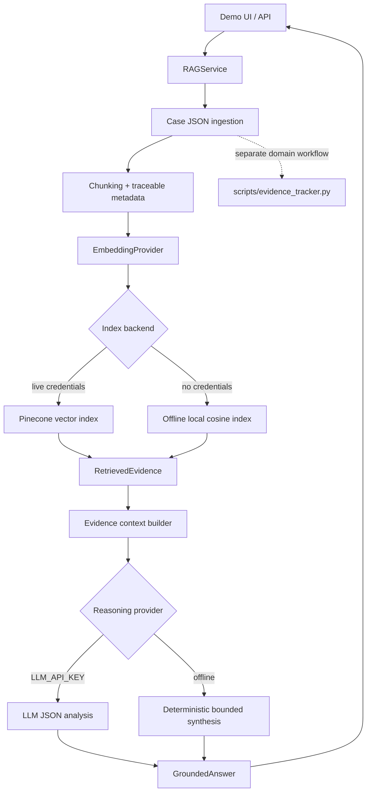

# Architecture

The original deterministic due-diligence analysis remains separate from the new retrieval and reasoning layers.

Pinecone is queried only when `PINECONE_API_KEY` and `PINECONE_INDEX` or `PINECONE_HOST` are set. The browser never receives credentials. `GroundedAnswer.evidence` is populated from returned chunks, preserving source and page metadata.

## Production deployment boundary

Cloudflare Worker `ddi` serves the static frontend. The existing Python HTTP service (`python3 -m app.api.server`) is deployed separately and exposes `/health` and `/api/query`. The frontend may set the browser-safe `window.DD_API_BASE` to the Python service origin; it never receives Pinecone or LLM secrets. The Python service restricts CORS to `https://ddi.maindev20.workers.dev` and keeps retrieval, embeddings, Pinecone, and reasoning server-side.

Fly.io packaging is provided by `Dockerfile` and `fly.toml`, but no Fly application is claimed as deployed in this repository until authenticated Fly CLI access and a successful production deployment are observed. The current reasoning implementation uses the OpenAI-compatible `LLM_API_KEY`/`LLM_MODEL` contract; OpenRouter and Claude Opus 5 are not silently substituted or claimed.
