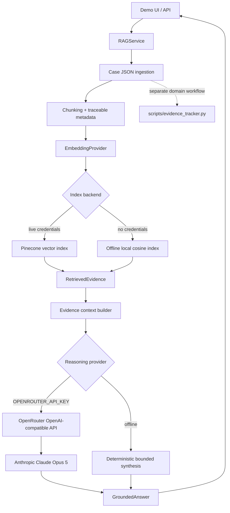

# Architecture

The original deterministic due-diligence analysis remains separate from the retrieval and reasoning layers.

The production flow is **documents → ingestion → chunking and metadata → embeddings → Pinecone → semantic retrieval → evidence context → OpenRouter → Anthropic Claude Opus 5 → evidence-grounded reasoning**. Embeddings and LLM reasoning are separate concerns: the existing embedding implementation uses `LLM_API_KEY`, `EMBEDDING_MODEL`, and `EMBEDDING_DIMENSION`, while reasoning uses `OPENROUTER_API_KEY`, `OPENROUTER_BASE_URL`, and `OPENROUTER_MODEL`. The OpenAI-compatible client is only the transport interface; OpenRouter is the reasoning provider.

Pinecone is queried only when `PINECONE_API_KEY` and `PINECONE_INDEX` or `PINECONE_HOST` are set. The browser never receives credentials. `GroundedAnswer.evidence` is populated from returned chunks, preserving source and page metadata. Without OpenRouter credentials, reasoning remains the bounded offline deterministic synthesis; with an OpenRouter key, provider failures are explicit and are not silently redirected to direct OpenAI reasoning.

## Production deployment boundary

Cloudflare Worker `ddi` serves the static frontend. The existing Python HTTP service (`python3 -m app.api.server`) is deployed separately and exposes `/health` and `/api/query`. The frontend may set the browser-safe `window.DD_API_BASE` to the Python service origin; it never receives Pinecone, embedding, or LLM secrets. The Python service restricts CORS to `https://ddi.maindev20.workers.dev` and keeps retrieval, embeddings, Pinecone, and reasoning server-side.

Lizard hosts the current Python service. Production credentials must be configured through Lizard server-side secrets and must never be committed to Git, Dockerfiles, frontend JavaScript, or documentation. Live OpenRouter/Claude validation is not claimed until a real production request is executed and its observed response is checked.
