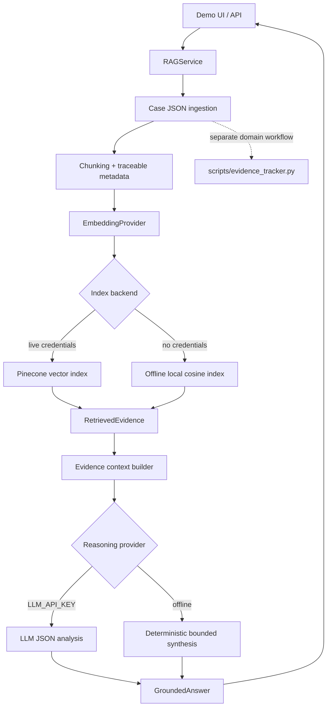

# Architecture

The original deterministic due-diligence analysis remains separate from the new retrieval and reasoning layers.

Pinecone is queried only when `PINECONE_API_KEY` and `PINECONE_INDEX` or `PINECONE_HOST` are set. The browser never receives credentials. `GroundedAnswer.evidence` is populated from returned chunks, preserving source and page metadata.
