# Due Diligence Intelligence

**Due Diligence Intelligence** is an evidence-centric retrieval-augmented generation (RAG) application for acquisition diligence. It converts structured source material into traceable evidence chunks, retrieves relevant passages from Pinecone, and assembles a bounded context for structured diligence reasoning.

The public repository uses a deliberately synthetic **Northstar** acquisition case. Northstar is not a real client, company, or transaction.

## Why evidence-centric diligence matters

Diligence requires more than finding text that is semantically similar to a question. A useful system must preserve provenance, distinguish management claims from stronger primary evidence, expose missing information, and keep inference separate from fact. The decision model is:

> **Finding → Evidence → Verification → Confidence → Risk or Opportunity → Decision Impact → Evidence Needed → Management Question**

Semantic similarity is a retrieval signal, not evidentiary truth. In live validation, `website-2025` had the highest similarity for a Northstar revenue query, while `audited-financials-2024` was the stronger direct evidentiary source. Evidence tiers and source metadata remain visible so reviewers can make that distinction.

## Architecture

```mermaid
flowchart LR
    C[Client] --> CF[Cloudflare static frontend]
    CF --> API[Lizard API]
    API --> HTTP[Python ThreadingHTTPServer :8000]
    HTTP --> RAG[RAG service]
    RAG --> ING[Ingestion and chunking]
    ING --> EMB[OpenRouter embeddings\ntext-embedding-3-small / 1536]
    EMB --> PC[Pinecone\nnorthstar-validation]
    PC --> RET[Semantic retrieval\nmetadata + scores]
    RET --> EVID[Evidence assembly\nE1...En]
    EVID --> LLM[OpenRouter\nClaude Opus 5]
    LLM --> OUT[Structured grounded response]
    OUT --> CF
```



The deployed split architecture is:

- **Cloudflare Worker `ddi`** serves the static frontend.
- **Lizard service `due-diligence-intelligence`** in `us-east-1` runs the Python API.
- The API binds to `0.0.0.0:8000` and is started with `python3 -m app.api.server`.
- The public API is `https://crew-trumpet-thv1.us-east-1.onlizard.com`.
- OpenRouter and Pinecone are server-side integrations; credentials never reach the browser.

## Pipeline

1. **Ingestion** reads the synthetic case source register.
2. **Chunking** creates 900-character chunks with 120-character overlap.
3. **Metadata enrichment** preserves document ID/name, source type, page, section, date, evidence tier, topic, and origin.
4. **Embedding** uses OpenRouter's OpenAI-compatible embeddings endpoint in the deployed configuration with `openai/text-embedding-3-small` and an explicit 1536-dimensional contract.
5. **Indexing** upserts chunks into Pinecone index `northstar-ddi`, namespace `northstar-validation`.
6. **Retrieval** embeds the question, queries Pinecone, and returns ranked matches with similarity scores and metadata.
7. **Evidence assembly** formats retrieved chunks as `[E1]`, `[E2]`, and so on.
8. **Reasoning** is wired to OpenRouter with `anthropic/claude-opus-5`; the prompt requires JSON, evidence citations, uncertainty, and missing evidence.
9. **API presentation** returns a structured diligence result to the frontend.

## Evidence model

Retrieved evidence contains the exact chunk text plus source metadata. The methodology uses evidence labels including `SUPPORTED`, `PARTIALLY SUPPORTED`, `UNVERIFIED`, `CONFLICTING EVIDENCE`, `APPARENT DISCREPANCY`, `INSUFFICIENT EVIDENCE`, and `ANALYST INFERENCE`.

The response schema preserves the question, finding, confidence, evidence, missing evidence, inference, provider label, and whether retrieval was live. The reasoning prompt instructs the provider to cite only supplied evidence labels and never invent facts.

## API overview

- `GET /health` returns `ok`, `retrieval_mode`, `embedding_model`, `upserted_chunks`, and `pinecone_available`.
- `POST /api/query` accepts `{"question": "...", "top_k": 5}` and returns `question`, `finding`, `confidence`, `evidence`, `missing_evidence`, `inference`, `provider`, and `live_retrieval`.
- `GET /demo` serves the browser demo.

`top_k` is clamped to 1–10. Missing or invalid questions return HTTP 400. The current handler does not translate arbitrary provider exceptions into an application error envelope; an upstream provider failure may therefore surface through the hosting proxy as HTTP 502. See [API.md](API.md) for the exact implementation-level schema.

## Validation status

| Area | Observed result |
|---|---|
| Service and `/health` | HTTP 200 validated |
| OpenRouter embeddings | Live request validated |
| Embedding dimension | 1536 observed; vectors are not padded, truncated, or reshaped |
| Pinecone connectivity | Live connection validated against `northstar-ddi` |
| Startup indexing | 5 synthetic chunks upserted to `northstar-validation` |
| Semantic retrieval | Live query returned 5 traceable matches |
| Metadata traceability | Document, page, section, evidence tier, topic, and similarity observed |
| Route validation | Public invalid requests returned structured HTTP 400 responses |
| Reasoning integration | OpenRouter/Claude Opus 5 request reached the provider |
| Final Claude generation | Not captured: OpenRouter returned HTTP 402 because the available token/credit budget blocked generation |

**Live OpenRouter embeddings and Pinecone retrieval have been validated in the deployed application.** The reasoning integration is wired into the deployed query path, but no final Claude-generated diligence answer is claimed from the last validation cycle.

## Local development

```bash
python3 -m venv .venv
. .venv/bin/activate
pip install -r requirements.txt
pip install -r requirements-rag.txt
python3 -m unittest discover -s tests -v
python3 -m app.api.server
```

Open `http://localhost:8000/demo`. Without live credentials, the service uses the explicitly labeled deterministic offline provider and reports `offline-demo`.

## Environment and security

Copy `.env.example` to an untracked local file or configure the variables in the hosting platform's secret manager. The template lists names only and contains no credentials. Production keys, tokens, authorization headers, private diligence materials, and customer data must remain outside Git and outside frontend code.

## Testing

The local suite covers the original evidence-calibration logic plus ingestion, chunking, metadata, provider selection, Pinecone host wiring, retrieval, grounding, and security boundaries. Standard validation commands are documented in [TESTING.md](TESTING.md).

## Future extensions

Possible extensions include a larger labeled retrieval benchmark, reranking or hybrid search, document upload adapters, conflict-aware evidence comparison, access control, audit logging, and a production-grade provider error envelope. These should preserve the separation between retrieved evidence and model-generated inference.

## Related documentation

- [Architecture](ARCHITECTURE.md)
- [RAG pipeline](RAG.md)
- [API](API.md)
- [Deployment](DEPLOYMENT.md)
- [Testing](TESTING.md)
- [Cloudflare frontend](CLOUDFLARE.md)
- [Synthetic case](sample/input/northstar_acquisition.json)

## Disclaimer

Northstar is synthetic demonstration data. This project is an analytical aid and does not provide legal, financial, investment, tax, accounting, regulatory, or transaction advice.

The repository originated as a Capafy-native due-diligence skill. The current showcase preserves that evidence-calibration methodology while adding a separately testable RAG architecture.

**Evidence first. Inference second. Verification always.**

This documentation update does not deploy the service, call OpenRouter, or write to Pinecone.

## Source map

- `app/`: runtime ingestion, embeddings, retrieval, reasoning, and HTTP API
- `scripts/`: deterministic report and quality workflows
- `references/`: diligence methodology and evidence standards
- `sample/`: synthetic Northstar input and example outputs
- `tests/`: unit and regression tests
- `public/`: Cloudflare static frontend

The active hosting target is Lizard; Fly.io and Render are historical packaging references, not the current deployment target.

## Operational principle

A useful diligence assistant should make it easier to challenge a conclusion, not merely easier to produce one.

**Synthetic demonstration only. No real client data or credentials are included.**

## End-to-end summary

**Documents → ingestion → parsing/extraction → chunking → metadata → embeddings → Pinecone → semantic retrieval → evidence filtering → reasoning → structured diligence finding.**

The central engineering decision is to keep each step inspectable.
